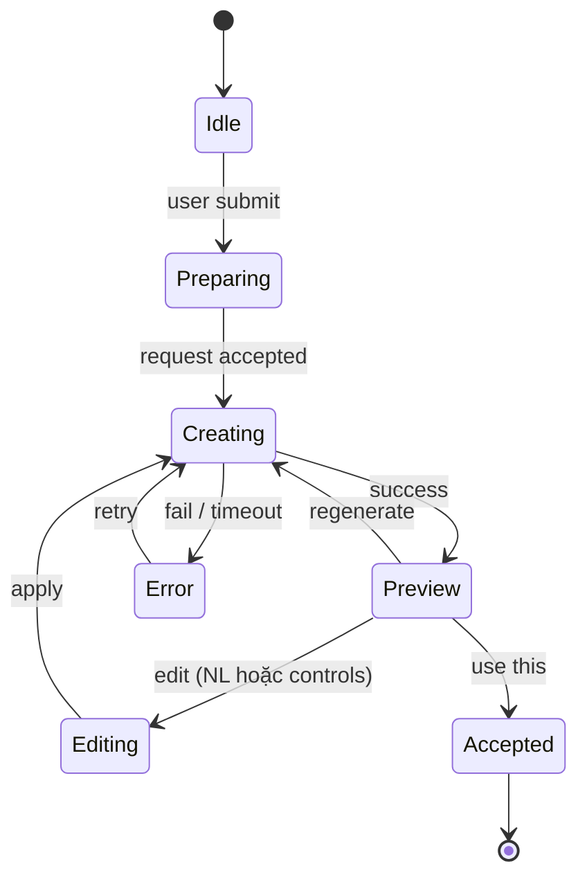
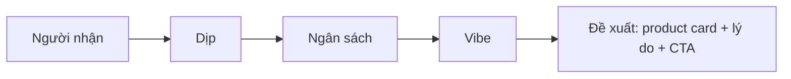
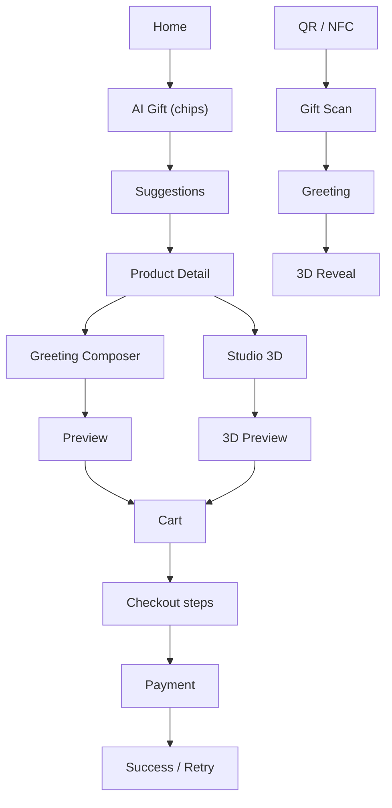

# CraftVision 3D — Mobile UX/UI Redesign Specification

> **Mobile-first • AI-native • Gift-first • Touch-friendly**
> Nền tảng: **Android** · State: **Riverpod** · Ngôn ngữ: **vi/en**
> Trạng thái: **Tài liệu thiết kế — chưa code.**

Tài liệu này là **lớp UX/UI bổ sung** cho kế hoạch kiến trúc Flutter (`mobile_implementation_plan`). Kế hoạch kiến trúc đã xác định feature, route, layer `data/domain/presentation` và ánh xạ Web → Flutter. Tài liệu này quyết định app **trông và hoạt động** như một sản phẩm mobile độc lập.

---

## 1. Đánh giá source hiện tại

**Kết luận:** kế hoạch hiện tại đủ tốt làm *technical/mobile architecture plan*, nhưng chưa phải *Mobile UX/UI specification*. Nó vẫn mang tư duy "port từng route Web sang Screen Flutter".

| Đã có | Còn thiếu | Cần thay đổi |
|---|---|---|
| Flutter feature-first, Riverpod, go_router | Mobile information architecture | Thiết kế flow theo **task** mobile |
| Bottom navigation + ShellRoute | Quy tắc 4–5 tab, ưu tiên nội dung | Bottom nav xoay quanh hành vi chính |
| Glass card, gradient, animation, theme tokens | Component specification | Xây design system mobile thống nhất |
| Chat AI, greeting AI, studio 3D | AI interaction model | AI là **lớp tương tác trung tâm**, không phải feature phụ |
| QR / NFC / deep link | Scan / reveal UX | Thiết kế trải nghiệm camera/NFC rõ ràng |
| Responsive/mobile screens | Touch target, keyboard, safe area, gesture | Mobile-first acceptance criteria |
| Route tương ứng Web | Mobile navigation patterns | Không bê nguyên modal/page layout của Web |

> [!IMPORTANT]
> **Tách "Web parity" khỏi "Mobile UX".** Parity bắt buộc ở **business logic và API**; **không** bắt buộc ở layout, navigation hay cấu trúc trang.

---

## 2. Nguyên tắc thiết kế bắt buộc

1. **Mobile-first, không phải Web thu nhỏ** — thiết kế cho màn hình hẹp trước.
2. **One primary action** — mỗi màn hình có đúng một CTA chính, dễ nhận biết.
3. **AI-first nhưng không AI-everywhere** — AI xuất hiện đúng nơi tạo giá trị, không biến app thành chatbot.
4. **Gift-first** — sản phẩm, lời chúc, NFC/QR và 3D là một trải nghiệm liền mạch.
5. **Progressive disclosure** — ẩn tuỳ chọn nâng cao đến khi người dùng cần.
6. **Bottom sheet trước modal lớn** cho thao tác ngắn; **full screen** cho task nhiều bước.
7. **Touch-first** — vùng chạm tối thiểu 44–48dp, không phụ thuộc hover.
8. **Keyboard-aware** — form và chat tự tránh bàn phím, CTA luôn thấy.
9. **Feedback tức thời** — loading, success, error, empty, offline đều có trạng thái rõ.
10. **Visual hierarchy** — ảnh sản phẩm / 3D / greeting là nội dung chính; text hỗ trợ, không cạnh tranh.

---

## 3. Định hướng Visual Design

Giữ tinh thần token hiện có (coral / butter / sage / clay, glass, gradient, Inter + Plus Jakarta Sans) nhưng **giảm cảm giác landing page Web**: nền sạch, ít card, khoảng trắng có chủ đích, typography mạnh.

| Hạng mục | Quy tắc |
|---|---|
| **Color** | Primary coral/cam cho CTA · butter làm highlight · sage/clay cho trạng thái phụ · neutral làm nền |
| **Typography** | Heading ngắn, lớn · body 14–16sp · caption 12–13sp · tránh paragraph dài |
| **Radius** | Card 16–20dp · button 12–16dp · bottom sheet 24dp góc trên |
| **Spacing** | Scale 4 / 8 / 12 / 16 / 24 / 32 · screen padding 16–20dp |
| **Images** | Full-width hoặc ratio ổn định · không nhồi nhiều card một màn hình |
| **AI visual** | Message có avatar/icon + trạng thái thinking · suggestion dạng chip/card · tránh hiệu ứng lòe loẹt |
| **Motion** | Micro-animation 150–300ms · giải thích trạng thái, không trang trí liên tục |
| **Theme** | Light + dark đều đạt contrast; token định nghĩa trong `core/theme` |

---

## 4. Navigation Mobile

Route Web vẫn giữ để **mapping code**, nhưng người dùng điều hướng theo **task**.

### 4.1 Bottom navigation (5 tab)

| Tab | Mục đích | Route gốc |
|---|---|---|
| **Home** | Khám phá, AI gift entry point, template/inspiration | `/home` |
| **Shop** | Tìm và chọn sản phẩm | `/shop` |
| **Create / AI** | Tạo lời chúc, gợi ý quà, tạo bằng AI | `/chat`, `/greeting-card`, `/studio` |
| **Manifest** | Xem/tạo nội dung cảm xúc, wish | `/manifest` |
| **Profile** | Đơn hàng, tài khoản, settings | `/profile`, `/settings` |

### 4.2 Guest vs đã đăng nhập

- Bottom nav **giữ nguyên 5 tab** cho cả hai trạng thái — không thêm/bớt tab để tránh mất phương hướng (thay đổi so với plan cũ vốn ẩn `chat`/`profile` cho guest).
- Guest dùng được: Home, Shop, Create (xem/thử), Manifest.
- Hành động cần account (Profile, đặt hàng, lưu quà, gọi AI có lưu lịch sử) → dẫn tới **auth bottom sheet/screen** rồi **quay lại đúng ngữ cảnh** (return-to route).
- Giỏ hàng guest được giữ lại sau khi đăng nhập.

### 4.3 Pattern điều hướng

| Tình huống | Pattern |
|---|---|
| Thao tác ngắn (filter, review, chọn tone, địa chỉ nhanh) | Bottom sheet |
| Task nhiều bước (checkout, composer, scan) | Full screen có step indicator |
| Chi tiết (product, order) | Push route, system back đúng stack |
| Hành động phá huỷ (huỷ đơn, xoá tài khoản) | Dialog xác nhận nhỏ |

---

## 5. Screen-by-screen UX/UI

| Screen | Vấn đề nếu port Web | Mobile UX đề xuất | CTA chính |
|---|---|---|---|
| **Landing** | Hero Web quá dài | 1 headline + visual + CTA; secondary CTA nhỏ; vào Shop/Explore ngay | Khám phá / Tạo quà với AI |
| **Home** | Dễ thành landing page | Ưu tiên AI gift prompt ("Bạn đang muốn tặng ai?"), sản phẩm nổi bật, inspiration/template; mỗi section ngắn | Tạo quà bằng AI |
| **Shop** | Grid Web thu nhỏ gây chật | Grid 2 cột; search cố định trên; category chips cuộn ngang; filter bằng bottom sheet | Xem sản phẩm |
| **Product Detail** | Cấu trúc desktop | Gallery lớn; giá + benefit rõ; **sticky bottom CTA**; review/details dạng accordion | Tặng món này |
| **Greeting Composer** | Form truyền thống, thiếu cảm giác AI | Chat-like composer + prompt suggestions + tone chips + preview | Tạo lời chúc bằng AI |
| **AI Gift Chat** | Thành hỏi đáp chung chung | AI hỏi ít, có chủ đích: người nhận → dịp → ngân sách → vibe → đề xuất | Nhận gợi ý quà |
| **Studio 3D** | Viewer chiếm hết màn hình | Preview 3D lớn + bottom control sheet | Dùng mẫu này |
| **Cart** | Bảng cart Web | Card item gọn; swipe-to-remove (tuỳ chọn); summary sticky đáy | Tiến hành thanh toán |
| **Checkout** | Form dài, dễ bỏ cuộc | Chia bước: Delivery → Gift → Payment → Review; giữ progress | Đặt hàng |
| **Payment** | WebView gây cảm giác rời app | Context rõ khi mở; success/cancel có state và recovery | Tôi đã thanh toán / Thử lại |
| **Gift Scan** | Chưa có UX NFC/QR | Permission → scanning → reveal transition → greeting → 3D; hướng dẫn ngắn từng bước | Mở quà |
| **Profile / Orders** | Quá nhiều menu | Dashboard đơn giản: avatar, trạng thái đơn, đơn gần đây, settings | Xem đơn hàng |

Quy tắc chung: **không tạo screen chỉ vì Web có route**. Mỗi screen phải có *user task* và *primary CTA* được ghi trong wireframe.

---

## 6. AI UX — lớp tương tác trung tâm

AI hiện có ở greeting, gift chat và 3D generation. Cần thiết kế như **interaction layer**, không chỉ là API.

### 6.1 Nguyên tắc

- Home có entry point rõ: **"Bạn đang muốn tặng ai?"** thay vì chỉ banner bán hàng.
- AI Gift Chat dùng **quick replies/chips** giảm typing: Sinh nhật · Người yêu · Bạn thân · Gia đình; ngân sách; phong cách.
- Kết quả AI **không chỉ là text**: mỗi suggestion = product card + lý do phù hợp + CTA.
- Greeting AI cho chỉnh **tone**: ấm áp / hài hước / ngắn gọn / lãng mạn / trang trọng.
- Mọi generation có trạng thái: **Preparing → Creating → Preview → Regenerate / Edit**.
- Cho sửa output bằng natural language **nhưng vẫn có controls rõ ràng** (tone, độ dài, emoji).
- AI **không tự thực hiện hành động có hậu quả** (đặt hàng, thanh toán) — luôn cần user confirm.
- Không lạm dụng typing animation; ưu tiên skeleton/progress rõ để tạo perceived speed.

### 6.2 State machine cho AI generation

### 6.3 Luồng hỏi của AI Gift Chat

Mỗi bước là một câu hỏi + chips; cho phép bỏ qua và quay lại sửa câu trả lời trước.

---

## 7. Mobile Component Checklist

Các component này nằm trong `core/widgets` (dùng chung) hoặc `features/<f>/presentation/widgets` (riêng feature), theo token ở `core/theme`.

| # | Component | Vị trí đề xuất |
|---|---|---|
| 1 | AppBar / compact header | `core/widgets` |
| 2 | Bottom navigation | `core/widgets` + `core/router/app_shell_scaffold` |
| 3 | Sticky bottom CTA | `core/widgets` |
| 4 | Product card | `shop/presentation/widgets` |
| 5 | Horizontal category chip | `shop/presentation/widgets` |
| 6 | Search bar | `core/widgets` |
| 7 | Filter bottom sheet | `shop/presentation/widgets` |
| 8 | AI message bubble | `chat/presentation/widgets` |
| 9 | AI suggestion card | `chat/presentation/widgets` |
| 10 | Prompt suggestion chip | `core/widgets` |
| 11 | AI generation progress | `core/widgets` |
| 12 | 3D viewer container | `studio/presentation/widgets` (tách khỏi UI thuần) |
| 13 | Image carousel | `shop/presentation/widgets` |
| 14 | Review sheet | `shop/presentation/widgets` |
| 15 | Order status timeline | `orders/presentation/widgets` |
| 16 | Empty / loading / error state | `core/widgets` |
| 17 | SnackBar / toast | `core/widgets` |
| 18 | Permission education screen | `core/widgets` / `gift` |
| 19 | QR scanner overlay | `gift/presentation/widgets` |
| 20 | NFC waiting state | `gift/presentation/widgets` |
| 21 | Gift reveal animation | `gift/presentation/widgets` |
| 22 | Checkout step indicator | `checkout/presentation/widgets` |

Mỗi component phải có **variant + state** (default, pressed, disabled, loading, error) trong design system.

---

## 8. Mobile Acceptance Criteria

Dùng làm Definition-of-Done cho **mọi** screen:

- [ ] Không horizontal overflow ở 320–430dp.
- [ ] CTA chính luôn nhìn thấy hoặc dễ tiếp cận khi hoàn thành task.
- [ ] Mọi control có vùng chạm đủ lớn (≥ 44–48dp).
- [ ] Không có thao tác hover-only.
- [ ] Keyboard không che input/CTA.
- [ ] System back/back gesture giữ đúng navigation stack.
- [ ] Loading / error / empty có thiết kế riêng (không chỉ `CircularProgressIndicator`).
- [ ] Dark/light không mất contrast.
- [ ] Ảnh mạng chậm có placeholder; lỗi ảnh có fallback.
- [ ] Guest flow và authenticated flow không làm user mất context.
- [ ] AI response có loading, retry, regenerate, edit.
- [ ] QR/NFC bị từ chối quyền vẫn có đường recovery (mở settings / nhập mã thủ công).
- [ ] 3D lỗi hoặc thiết bị yếu không block toàn app (fallback ảnh preview).
- [ ] Checkout quay lại chỉnh sửa không mất dữ liệu đã nhập.

---

## 9. Flow ưu tiên thiết kế trước

Chỉ wireframe/prototype **5 flow** này trước; screen còn lại follow component và pattern đã chốt.

| Flow | Đường đi | Ghi chú UX chính |
|---|---|---|
| **A** | Home → AI Gift → Suggestion → Product → Greeting → Cart | Chips, product card + lý do |
| **B** | Product → Greeting AI → Preview → Add to Cart | Tone chips, regenerate/edit |
| **C** | Product → 3D Studio → Generate → Preview → Save/Use | Progress, fallback thiết bị yếu |
| **D** | Cart → Checkout → Payment → Success | Step indicator, recovery khi cancel |
| **E** | QR/NFC → Gift Scan → Greeting → 3D Reveal | Permission, reveal transition |

---

## 10. Thay đổi so với plan kiến trúc

1. Giữ nguyên architecture `data/domain/presentation` và route mapping.
2. Thêm **design layer** cho mobile: mở rộng `core/theme` + `core/widgets` theo mục 3 và 7.
3. **Không tạo screen chỉ vì Web có route**; mỗi screen có user task + CTA.
4. Thêm **Phase UX trước Phase 1–2** (xem mục 11).
5. **Phase 3–8 phải có wireframe acceptance** trước khi implement từng feature.
6. Tách **Web parity** (logic/API) khỏi **Mobile UX** (layout/nav).
7. **AI / Gift / 3D là nhóm trải nghiệm trọng tâm**, được đưa lên sớm trong roadmap thay vì nằm cuối.
8. Bottom nav cố định 5 tab cho cả guest và logged-in (sửa plan cũ).
9. Route `/chat`, `/greeting-card`, `/studio` gom dưới tab **Create / AI**.

### 10.1 Roadmap điều chỉnh (đề xuất)

| Phase | Nội dung | Gate |
|---|---|---|
| **0** | Khởi tạo project, lint, đối chiếu `openapi.yaml` | `flutter analyze` sạch |
| **0.5 (UX)** | Design system, component inventory, wireframe 5 flow, a11y checklist | Duyệt wireframe |
| **1** | Core: theme tokens mới, network, storage, error, router, l10n, widget chung | App chạy, unit test interceptor |
| **2** | Auth (bottom-sheet, return-to route) + Shell 5 tab | Guest/login không mất context |
| **3** | Shop + Product Detail + Home (AI entry) | Wireframe B/A đạt |
| **4** | **AI/Gift core**: Gift chat, Greeting composer, Cart | Flow A, B chạy thật |
| **5** | Checkout nhiều bước + Orders | Flow D (COD) |
| **6** | Payment PayOS + recovery | Flow D (đầy đủ) |
| **7** | Studio 3D | Flow C |
| **8** | Gift Scan (QR/NFC/deep link) + Manifest + Profile/Settings + Legal | Flow E |
| **9** | Polish, a11y, test, CI, build APK | Tick hết mục 8 |

> [!NOTE]
> Thứ tự 3–8 có thể điều chỉnh theo ưu tiên demo; ràng buộc cứng là **UX gate trước implement**.

---

## 11. Deliverables cho Designer / Developer

| # | Deliverable | Định dạng gợi ý |
|---|---|---|
| 1 | Mobile Design System (color, typography, spacing, radius, elevation, states) | Figma + `core/theme` |
| 2 | Component inventory + variants | Figma + bảng mục 7 |
| 3 | Wireframe 5 flow ưu tiên | Figma |
| 4 | High-fidelity: Home, Shop, Product Detail, AI Gift, Greeting, Studio, Cart, Checkout, Gift Scan | Figma |
| 5 | Prototype: AI generation, 3D preview, Gift Reveal | Figma prototype |
| 6 | Accessibility checklist | Markdown (mục 8 mở rộng) |
| 7 | Flutter implementation mapping: component → widget/file | Bảng bổ sung vào doc kiến trúc |

---

## 12. Kết luận

Vấn đề chính **không phải** Flutter hay cấu trúc thư mục, mà là tư duy **port Web → Mobile**. Bản mobile giữ **API, business logic và feature coverage**; còn **navigation, hierarchy, interaction, CTA, AI interaction và trải nghiệm gift/3D** phải được thiết kế lại theo hành vi chạm và kích thước màn hình mobile.

---

## Tham chiếu

- Kế hoạch kiến trúc: `mobile_implementation_plan` (Flutter, feature-first, Riverpod, go_router).
- Phân tích web hiện có: [frontend_analysis.md](./frontend_analysis.md)
- Cấu trúc dự án: [Project_Structure.md](./Project_Structure.md)
