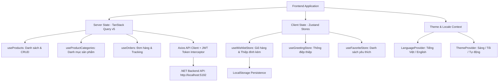

# 📋 Phân tích Frontend — CraftVision 3D

---

## 1. Ràng buộc bắt buộc về Design (Màu sắc, Font, Cấu trúc)

### 🎨 Hệ thống màu sắc (Design Tokens)

Toàn bộ hệ thống màu được định nghĩa trong [globals.css](file:///d:/03_Dev/01_Projects/01_MyProject/04_GitHub/EXE201/1/CraftVision_3D/frontend/src/app/globals.css) bằng **OKLCH color space** — một hệ thống màu hiện đại, độ chính xác quang học cao và tương thích mượt mà giữa Light Mode và Dark Mode.

#### Light Mode (`:root`)
| Token | Giá trị OKLCH / CSS | Mô tả |
|---|---|---|
| `--background` | `oklch(0.98 0.02 85)` | Nền ấm, kem vàng nhẹ |
| `--foreground` | `oklch(0.28 0.05 45)` | Chữ nâu đậm tự nhiên |
| `--primary` | `oklch(0.74 0.18 55)` | **Cam ấm** — màu thương hiệu chủ đạo |
| `--coral` | `oklch(0.72 0.2 25)` | **San hô / Đỏ cam** — màu nhấn CTA |
| `--butter` | `oklch(0.92 0.12 85)` | **Vàng bơ** — màu phụ trợ highlight |
| `--sage` | `oklch(0.85 0.05 150)` | **Xanh xô thơm** — màu dịu mắt |
| `--clay` | `oklch(0.65 0.1 40)` | **Nâu đất nung** — màu sắc thủ công |
| `--destructive` | `oklch(0.63 0.24 27)` | Đỏ cảnh báo / xóa bỏ |
| `--muted-foreground` | `oklch(0.52 0.04 50)` | Chữ phụ, ghi chú mờ |
| `--border` | `oklch(0.9 0.02 70)` | Đường viền mảnh tinh tế |

#### Dark Mode (`.dark`)
| Token | Mô tả |
|---|---|
| `--background` | Nền nâu đen trầm `oklch(0.18 0.02 45)` |
| `--primary` | Cam sáng nổi bật `oklch(0.76 0.2 55)` |
| `--border` | `oklch(1 0 0 / 10%)` — viền mờ 10% |

> [!NOTE]
> Hệ thống hỗ trợ Dark Mode thông qua [ThemeProvider.tsx](file:///d:/03_Dev/01_Projects/01_MyProject/04_GitHub/EXE201/1/CraftVision_3D/frontend/src/components/ThemeProvider.tsx) (`next-themes`) với nút chuyển đổi Sáng / Tối / Tự động hoạt động đầy đủ trong tab Giao diện của [Settings](file:///d:/03_Dev/01_Projects/01_MyProject/04_GitHub/EXE201/1/CraftVision_3D/frontend/src/app/settings/page.tsx).

#### Gradient & Hiệu ứng đặc biệt
| Utility | Mô tả |
|---|---|
| `--gradient-primary` | `135deg: coral → clay` |
| `--gradient-aurora` | `135deg: hồng → vàng → xanh lá` |
| `--shadow-glow` | Quầng sáng cam ấm phát quang |
| `--shadow-coral` | Đổ bóng san hô mềm |
| `--shadow-coral-glow` | Quầng sáng san hô khuếch tán rộng (`blur` lớn) khi hover card/ảnh |
| `--shadow-soft` | Đổ bóng card tinh tế |

---

### 🔤 Hệ thống Font chữ

Được cấu hình trong [layout.tsx](file:///d:/03_Dev/01_Projects/01_MyProject/04_GitHub/EXE201/1/CraftVision_3D/frontend/src/app/layout.tsx):

| Font | CSS Variable | Ứng dụng |
|---|---|---|
| **Inter** | `--font-sans` | Body text (nội dung, mô tả, bảng biểu) |
| **Plus Jakarta Sans** | `--font-display` | Headings (h1–h4), tiêu đề hero, nhãn nổi bật |

- Cả 2 font hỗ trợ subsets: `vietnamese` + `latin`.
- Tiêu đề sử dụng `letter-spacing: -0.02em` và font weight `700`/`800`.

---

### 🧊 Hệ thống Utility CSS tự viết (Tailwind CSS v4)

Trong [globals.css](file:///d:/03_Dev/01_Projects/01_MyProject/04_GitHub/EXE201/1/CraftVision_3D/frontend/src/app/globals.css), project tạo các `@utility` riêng:

| Utility class | Mô tả |
|---|---|
| `glass-strong` | Glassmorphism đậm (70% trắng / mờ, blur 12px) |
| `glass-card` | Glassmorphism tiêu chuẩn cho thẻ (60% trắng / mờ, blur 8px, viền mờ) |
| `btn-hero` | Nút kêu gọi hành động chính: gradient coral-clay, hover nâng 6px, tăng sáng, scale nhẹ |
| `gradient-text` | Chữ hiệu ứng gradient chuyển màu |
| `blob` | Quầng màu tròn chuyển động nền (blur 80px - 100px) |
| `animate-float` | Chuyển động lơ lửng bồng bềnh chu kỳ 6s |
| `animate-pulse-glow` | Đổi kích thước và độ phát sáng quầng màu nền chu kỳ 4s |
| `animate-fade-up` | Xuất hiện từ dưới trượt lên kèm hiệu ứng mờ dần |
| `animate-fade-in-page` | Mở trang mới: scale từ `0.98` lên `1` kèm làm nét blur (0.4s) |

---

## 2. Danh sách các trang và Routes hiện tại

Hệ thống được chia thành 2 phân hệ chính: **Phân hệ Khách hàng (Client Portal)** và **Phân hệ Quản trị (Admin Portal)**.

### 2.1. Phân hệ Khách hàng (Client Portal)

| # | Route | Tệp nguồn | Mô tả chức năng | Layout | Trạng thái API |
|---|---|---|---|---|---|
| 1 | `/` | [page.tsx](file:///d:/03_Dev/01_Projects/01_MyProject/04_GitHub/EXE201/1/CraftVision_3D/frontend/src/app/page.tsx) | **Landing Page** — Giới thiệu tổng quan, video giới thiệu, CTA khám phá | Standalone | Static |
| 2 | `/auth` | [page.tsx](file:///d:/03_Dev/01_Projects/01_MyProject/04_GitHub/EXE201/1/CraftVision_3D/frontend/src/app/auth/page.tsx) | **Đăng nhập / Đăng ký** — Form xác thực, Google OAuth, lưu JWT token | Standalone | ✅ Gọi API Backend (`/api/auth`) |
| 3 | `/home` | [page.tsx](file:///d:/03_Dev/01_Projects/01_MyProject/04_GitHub/EXE201/1/CraftVision_3D/frontend/src/app/home/page.tsx) | **Trang chủ** — Hero carousel 3 slide, mục sản phẩm mẫu thiệp 3D, modal demo thiệp 3D, video hướng dẫn | AppShell | ✅ Dữ liệu mẫu & router trực tiếp |
| 4 | `/shop` | [page.tsx](file:///d:/03_Dev/01_Projects/01_MyProject/04_GitHub/EXE201/1/CraftVision_3D/frontend/src/app/shop/page.tsx) | **Cửa hàng** — Lưới sản phẩm, bộ lọc danh mục động từ database, tìm kiếm, lưu mục yêu thích | AppShell | ✅ Gọi API Backend (`/api/products`, `/api/product-categories`) |
| 5 | `/shop/[id]` | [page.tsx](file:///d:/03_Dev/01_Projects/01_MyProject/04_GitHub/EXE201/1/CraftVision_3D/frontend/src/app/shop/[id]/page.tsx) | **Chi tiết sản phẩm** — Ảnh chi tiết, mô tả, đánh giá sao, nút "Thêm vào giỏ hàng" và "Thiết kế câu chúc riêng" | AppShell | ✅ Gọi API Backend (`/api/products/{id}`, `/api/reviews`) |
| 6 | `/shop/[id]/greeting` | [page.tsx](file:///d:/03_Dev/01_Projects/01_MyProject/04_GitHub/EXE201/1/CraftVision_3D/frontend/src/app/shop/[id]/greeting/page.tsx) | **Thiết kế thiệp điện tử** — Nhập người gửi/nhận, lời chúc, tải ảnh lên Cloudinary. Cung cấp 2 lựa chọn: **Xem trước** (Modal popup mở thiệp trực tiếp hoặc thanh toán) và **Thanh toán ngay** | AppShell | ✅ Tích hợp Cloudinary & Checkout chuyển tiếp |
| 7 | `/greeting-card` | [page.tsx](file:///d:/03_Dev/01_Projects/01_MyProject/04_GitHub/EXE201/1/CraftVision_3D/frontend/src/app/greeting-card/page.tsx) | **Trải nghiệm thiệp 3D trực tuyến** — Three.js / React Three Fiber, hiệu ứng mở phong bì 3D, đọc tâm thư tùy biến, hiển thị ảnh kỷ niệm, phát nhạc nền du dương, nút thanh toán trực tiếp | Standalone (Full 3D Canvas) | ✅ Đọc query params & session storage động |
| 8 | `/cart` | [page.tsx](file:///d:/03_Dev/01_Projects/01_MyProject/04_GitHub/EXE201/1/CraftVision_3D/frontend/src/app/cart/page.tsx) | **Giỏ hàng** — Quản lý sản phẩm, chỉnh sửa số lượng, xem trước/chỉnh sửa lại nội dung thiệp đã thiết kế mà không làm tăng biến đếm, tính tiền tạm tính | AppShell | ✅ Zustand Store (`useWishlistStore`) |
| 9 | `/checkout` | [page.tsx](file:///d:/03_Dev/01_Projects/01_MyProject/04_GitHub/EXE201/1/CraftVision_3D/frontend/src/app/checkout/page.tsx) | **Thanh toán đơn hàng** — Nhập địa chỉ nhận, phương thức thanh toán (QR Banking, ZaloPay, COD). **Tự động áp dụng phí ship 0đ đối với đơn hàng chỉ có thiệp số** | AppShell | ✅ Gọi API Backend (`/api/orders`) |
| 10 | `/preorder/[productId]` | [page.tsx](file:///d:/03_Dev/01_Projects/01_MyProject/04_GitHub/EXE201/1/CraftVision_3D/frontend/src/app/preorder/[productId]/page.tsx) | **Đặt trước thủ công** — Đặt làm sản phẩm quà tặng thủ công riêng với thời gian sản xuất ước tính | AppShell | ✅ Gọi API Backend (`/api/preorders`) |
| 11 | `/gift/scan/[secretKey]` | [page.tsx](file:///d:/03_Dev/01_Projects/01_MyProject/04_GitHub/EXE201/1/CraftVision_3D/frontend/src/app/gift/scan/[secretKey]/page.tsx) | **Quét thẻ NFC quà tặng** — Trải nghiệm mở quà khi quét chip NFC gắn trên sản phẩm thủ công | Standalone | ✅ Xác thực khóa bí mật qua API |
| 12 | `/settings` | [page.tsx](file:///d:/03_Dev/01_Projects/01_MyProject/04_GitHub/EXE201/1/CraftVision_3D/frontend/src/app/settings/page.tsx) | **Cài đặt người dùng & Lịch sử đơn hàng** — 5 tabs: **Tài khoản**, **Đơn hàng** (xem lịch sử, lọc trạng thái, modal chi tiết hành trình vận chuyển, xem lại thiệp 3D), **Bảo mật**, **Giao diện** (chọn theme), **Ngôn ngữ** | AppShell | ✅ Gọi API Backend (`/api/orders`, `/api/users`) |
| 13 | `/chat` | [page.tsx](file:///d:/03_Dev/01_Projects/01_MyProject/04_GitHub/EXE201/1/CraftVision_3D/frontend/src/app/chat/page.tsx) | **Trợ lý AI thủ công** — Tư vấn ý tưởng làm quà, bảng nguyên liệu, gợi ý công cụ | AppShell | ✅ Kết nối AI service / route handler |
| 14 | `/studio` | [page.tsx](file:///d:/03_Dev/01_Projects/01_MyProject/04_GitHub/EXE201/1/CraftVision_3D/frontend/src/app/studio/page.tsx) | **Studio 3D Canvas** — Xem và tùy biến mô hình 3D trong không gian tương tác | AppShell | ✅ Three.js WebGL Engine |
| 15 | `/pricing`, `/privacy`, `/terms`, `/refunds` | `page.tsx` | **Trang thông tin & pháp lý** — Bảng giá dịch vụ, chính sách bảo mật, điều khoản, hoàn tiền | AppShell | Static / Markdown Content |

> [!IMPORTANT]
> **Thay đổi cấu trúc:** Trang `/profile` cũ đã được **xóa bỏ hoàn toàn**. Toàn bộ tính năng Lịch sử đơn hàng, xem chi tiết hành trình giao vận và quản lý tài khoản đã được **hợp nhất hoàn chỉnh vào trang Cài đặt ([/settings?tab=orders](file:///d:/03_Dev/01_Projects/01_MyProject/04_GitHub/EXE201/1/CraftVision_3D/frontend/src/app/settings/page.tsx))**.

---

### 2.2. Phân hệ Quản trị (Admin Portal)

Tất cả các route quản trị đều nằm dưới layout dùng chung [AdminLayout.tsx](file:///d:/03_Dev/01_Projects/01_MyProject/04_GitHub/EXE201/1/CraftVision_3D/frontend/src/app/admin/layout.tsx) với Sidebar chuyên biệt:

| Route | Tệp nguồn | Chức năng chi tiết | Trạng thái API |
|---|---|---|---|
| `/admin/orders` | [page.tsx](file:///d:/03_Dev/01_Projects/01_MyProject/04_GitHub/EXE201/1/CraftVision_3D/frontend/src/app/admin/orders/page.tsx) | **Quản lý đơn hàng** — Xem bảng đơn, tìm kiếm, lọc trạng thái, cập nhật trạng thái đơn hàng (Đang xử lý, Đang giao, Hoàn thành) | ✅ Gọi API Backend (`/api/orders`, `/api/orders/{id}/status`) |
| `/admin/products` | [page.tsx](file:///d:/03_Dev/01_Projects/01_MyProject/04_GitHub/EXE201/1/CraftVision_3D/frontend/src/app/admin/products/page.tsx) | **Quản lý sản phẩm** — CRUD sản phẩm, phân trang, tải nhiều ảnh lên Cloudinary, dropdown danh mục động tự map khi sửa | ✅ Gọi API Backend (`/api/products`, Cloudinary API) |
| `/admin/categories` | [page.tsx](file:///d:/03_Dev/01_Projects/01_MyProject/04_GitHub/EXE201/1/CraftVision_3D/frontend/src/app/admin/categories/page.tsx) | **Quản lý danh mục** — Xem danh sách danh mục sản phẩm, tạo danh mục mới, xóa danh mục | ✅ Gọi API Backend (`/api/product-categories`) |
| `/admin/nfc` | [page.tsx](file:///d:/03_Dev/01_Projects/01_MyProject/04_GitHub/EXE201/1/CraftVision_3D/frontend/src/app/admin/nfc/page.tsx) | **Kho thẻ NFC** — Quản lý thẻ NFC, tạo mã liên kết, gán sản phẩm vào chip NFC | ✅ Gọi API Backend (`/api/nfc`) |
| `/admin/videos` | [page.tsx](file:///d:/03_Dev/01_Projects/01_MyProject/04_GitHub/EXE201/1/CraftVision_3D/frontend/src/app/admin/videos/page.tsx) | **Quản lý video hướng dẫn** — Quản lý video tutorial hướng dẫn khách hàng thanh toán và thiết kế | ✅ Gọi API Backend (`/api/template-videos`) |

---

## 3. Cấu trúc Source Code Frontend

```
frontend/
├── public/                           # Tài nguyên tĩnh: ảnh nền 3D, âm thanh, icon, logo
│   ├── dreamy-hero-bg.jpg
│   ├── anh2.png, anh3.jpg
│   ├── audio/autumn_romance.mp3      # Nhạc nền thiệp 3D
│   └── image/                        # Logo, banner, minh họa
├── src/
│   ├── app/                          # Next.js App Router (Client & Admin)
│   │   ├── layout.tsx                # Root layout (Fonts, Providers: React Query, Language, Theme)
│   │   ├── globals.css               # Design system OKLCH, utilities, animations
│   │   ├── page.tsx                  # Landing page (/)
│   │   ├── auth/page.tsx             # Login & Register
│   │   ├── home/page.tsx             # Home Hero Carousel & Template Products
│   │   ├── shop/                     # Shop listing & Details
│   │   │   ├── page.tsx
│   │   │   └── [id]/
│   │   │       ├── page.tsx          # Product Detail
│   │   │       └── greeting/page.tsx # Greeting Card Editor & Preview Modal
│   │   ├── greeting-card/page.tsx    # Live 3D Web Greeting Card (Three.js)
│   │   ├── cart/page.tsx             # Shopping Cart with order customization
│   │   ├── checkout/page.tsx         # Checkout (0đ shipping logic for digital cards)
│   │   ├── settings/page.tsx         # User Settings (Profile, Orders tracking, Security, Theme, Language)
│   │   ├── preorder/[productId]/     # Custom PreOrder workflow
│   │   ├── gift/scan/[secretKey]/    # NFC Tap & Gift Redemption
│   │   ├── chat/page.tsx             # AI Craft Assistant
│   │   ├── studio/page.tsx           # 3D Studio Canvas
│   │   ├── admin/                    # Admin Portal
│   │   │   ├── layout.tsx            # Admin Sidebar Layout
│   │   │   ├── orders/page.tsx       # Order management
│   │   │   ├── products/page.tsx     # Product CRUD & Modal
│   │   │   ├── categories/page.tsx   # Category CRUD
│   │   │   ├── nfc/page.tsx          # NFC chip management
│   │   │   └── videos/page.tsx       # Video tutorial management
│   │   └── api/                      # Next.js Server Route Handlers
│   ├── components/                   # Components tái sử dụng
│   │   ├── AppShell.tsx              # Main Navigation bar, Cart button, User menu, Footer
│   │   ├── LanguageProvider.tsx      # i18n Context (Tiếng Việt & English)
│   │   ├── ThemeProvider.tsx         # Dark / Light Theme Context (next-themes)
│   │   ├── StarryBackground.tsx      # Hiệu ứng bầu trời sao lung linh
│   │   ├── TiltCard.tsx              # Thẻ sản phẩm với hiệu ứng nghiêng 3D
│   │   ├── home/                     # Components trang chủ
│   │   │   ├── TemplateProductsSection.tsx # Danh sách mẫu thiệp nổi bật
│   │   │   ├── ProductDemoModal.tsx        # Modal xem demo thiệp 3D
│   │   │   └── TutorialVideoModal.tsx      # Modal video hướng dẫn
│   │   ├── greeting-card/            # 3D Greeting Card System
│   │   │   ├── AudioPlayer.tsx       # Điều khiển nhạc nền du dương
│   │   │   ├── EnvelopeUnfold.tsx    # Hoạt cảnh mở phong bì & lá thư tâm tình
│   │   │   └── scene/
│   │   │       └── SceneContainer.tsx# Canvas Three.js chứa hạt lấp lánh & ánh sáng
│   │   └── ui/                       # Bộ thư viện UI primitives (shadcn/ui + Radix)
│   ├── hooks/                        # Custom React Hooks & TanStack Query Hooks
│   │   ├── useProducts.ts            # Query & Mutation cho Sản phẩm (CRUD, phân trang)
│   │   ├── useProductCategories.ts   # Query & Mutation cho Danh mục
│   │   ├── useOrders.ts              # Query danh sách đơn & cập nhật trạng thái đơn
│   │   ├── usePreOrder.ts            # Hook quản lý Đặt trước sản phẩm
│   │   ├── useReviews.ts             # Đánh giá & nhận xét sản phẩm
│   │   └── use-mobile.tsx            # Responsive Breakpoint detection
│   ├── lib/                          # Tiện ích cốt lõi & API clients
│   │   ├── api.ts                    # Axios client chính (JWT Interceptor, backend URL)
│   │   ├── apiClient.ts              # Fetch API helper
│   │   ├── dictionaries.ts           # Bản dịch Đa ngôn ngữ (VI / EN)
│   │   ├── product.types.ts          # Định nghĩa TypeScript cho Product & Category
│   │   └── utils.ts                  # cn() merging helper
│   └── store/                        # Global Client State Management (Zustand)
│       ├── useWishlistStore.ts       # Quản lý giỏ hàng & sản phẩm yêu thích (LocalStorage Persist)
│       ├── useOrderStore.ts          # Trạng thái đặt hàng
│       ├── useGreetingStore.ts       # Lưu thông điệp, hình ảnh thiệp đang thiết kế
│       └── useFavoriteStore.ts       # Mục sản phẩm yêu thích
├── package.json                      # Next.js 16 + React 19 + Three.js + TanStack Query
└── tsconfig.json
```

---

## 4. Kiến trúc State Management & Quản lý Dữ liệu

Ứng dụng áp dụng mô hình phân tách trạng thái hiện đại và tối ưu:



1. **Server State (Dữ liệu máy chủ):**
   - Sử dụng **TanStack React Query v5** quản lý cache, background refetch, pagination và invalidate mutations.
   - Toàn bộ request đi qua instance [api.ts](file:///d:/03_Dev/01_Projects/01_MyProject/04_GitHub/EXE201/1/CraftVision_3D/frontend/src/lib/api.ts) tự động gắn JWT Token từ `localStorage` vào Authorization Header.
2. **Client State (Trạng thái cục bộ & Giỏ hàng):**
   - Sử dụng **Zustand** với middleware `persist` tự động đồng bộ xuống `localStorage`.
   - Giỏ hàng lưu trữ đầy đủ thông tin: ID sản phẩm, số lượng, loại sản phẩm (Vật lý / Thiệp số), tùy biến lời chúc và link thiệp 3D.
3. **i18n & Giao diện:**
   - Hệ thống chuyển đổi ngôn ngữ linh hoạt thông qua [LanguageProvider.tsx](file:///d:/03_Dev/01_Projects/01_MyProject/04_GitHub/EXE201/1/CraftVision_3D/frontend/src/components/LanguageProvider.tsx) và bộ từ điển [dictionaries.ts](file:///d:/03_Dev/01_Projects/01_MyProject/04_GitHub/EXE201/1/CraftVision_3D/frontend/src/lib/dictionaries.ts).

---

## 5. Trạng thái kết nối API Backend & Tích hợp Dịch vụ

Khác với giai đoạn đầu sơ khai, hệ thống hiện đã **kết nối hoàn chỉnh với Backend .NET** (`http://localhost:5192`):

| Nghiệp vụ | Backend Endpoint | Hook / Component đảm nhiệm | Trạng thái |
|---|---|---|---|
| **Đăng ký tài khoản** | `POST /api/auth/register` | [AuthPage](file:///d:/03_Dev/01_Projects/01_MyProject/04_GitHub/EXE201/1/CraftVision_3D/frontend/src/app/auth/page.tsx) | ✅ Hoạt động đầy đủ |
| **Đăng nhập & JWT** | `POST /api/auth/login` | [AuthPage](file:///d:/03_Dev/01_Projects/01_MyProject/04_GitHub/EXE201/1/CraftVision_3D/frontend/src/app/auth/page.tsx) | ✅ Hoạt động đầy đủ (Lưu Token & User Info) |
| **Google OAuth** | Google Identity Services | [AuthPage](file:///d:/03_Dev/01_Projects/01_MyProject/04_GitHub/EXE201/1/CraftVision_3D/frontend/src/app/auth/page.tsx) | ✅ Tích hợp `@react-oauth/google` |
| **Lấy danh sách sản phẩm** | `GET /api/products` | [useProducts](file:///d:/03_Dev/01_Projects/01_MyProject/04_GitHub/EXE201/1/CraftVision_3D/frontend/src/hooks/useProducts.ts) | ✅ Phân trang, tìm kiếm, lọc theo loại |
| **Chi tiết sản phẩm** | `GET /api/products/{id}` | [useProduct](file:///d:/03_Dev/01_Projects/01_MyProject/04_GitHub/EXE201/1/CraftVision_3D/frontend/src/hooks/useProducts.ts) | ✅ Hiển thị đầy đủ hình ảnh, giá, tồn kho |
| **CRUD sản phẩm (Admin)** | `POST`, `PUT`, `DELETE /api/products` | [ProductModal](file:///d:/03_Dev/01_Projects/01_MyProject/04_GitHub/EXE201/1/CraftVision_3D/frontend/src/app/admin/products/components/ProductModal.tsx) | ✅ Tự map danh mục, upload nhiều ảnh |
| **Danh mục sản phẩm** | `GET`, `POST`, `DELETE /api/product-categories` | [useProductCategories](file:///d:/03_Dev/01_Projects/01_MyProject/04_GitHub/EXE201/1/CraftVision_3D/frontend/src/hooks/useProductCategories.ts) | ✅ Đồng bộ danh mục cho Shop & Admin |
| **Tạo đơn hàng & Thanh toán** | `POST /api/orders` | [CheckoutPage](file:///d:/03_Dev/01_Projects/01_MyProject/04_GitHub/EXE201/1/CraftVision_3D/frontend/src/app/checkout/page.tsx) | ✅ Tính ship 0đ cho thiệp số, hỗ trợ QR/ZaloPay/COD |
| **Lịch sử & Chi tiết đơn hàng** | `GET /api/orders`, `GET /api/orders/{id}` | [SettingsPage](file:///d:/03_Dev/01_Projects/01_MyProject/04_GitHub/EXE201/1/CraftVision_3D/frontend/src/app/settings/page.tsx) | ✅ Xem hành trình vận chuyển, link thiệp 3D |
| **Cập nhật trạng thái đơn (Admin)** | `PATCH /api/orders/{id}/status` | [AdminOrdersPage](file:///d:/03_Dev/01_Projects/01_MyProject/04_GitHub/EXE201/1/CraftVision_3D/frontend/src/app/admin/orders/page.tsx) | ✅ Cập nhật realtime qua React Query |
| **Đánh giá sản phẩm** | `GET`, `POST /api/reviews` | [useReviews](file:///d:/03_Dev/01_Projects/01_MyProject/04_GitHub/EXE201/1/CraftVision_3D/frontend/src/hooks/useReviews.ts) | ✅ Gửi đánh giá sao & nhận xét |
| **Tải ảnh lên đám mây** | Cloudinary REST API | [ProductModal](file:///d:/03_Dev/01_Projects/01_MyProject/04_GitHub/EXE201/1/CraftVision_3D/frontend/src/app/admin/products/components/ProductModal.tsx) & [GreetingPage](file:///d:/03_Dev/01_Projects/01_MyProject/04_GitHub/EXE201/1/CraftVision_3D/frontend/src/app/shop/[id]/greeting/page.tsx) | ✅ Tải ảnh trực tiếp từ trình duyệt |
| **Mở quà qua thẻ NFC** | `GET /api/nfc/verify/{secretKey}` | [GiftScanPage](file:///d:/03_Dev/01_Projects/01_MyProject/04_GitHub/EXE201/1/CraftVision_3D/frontend/src/app/gift/scan/[secretKey]/page.tsx) | ✅ Quét NFC mở thiệp 3D |

---

## 6. Tổng kết hiện trạng

| Hạng mục | Trạng thái | Đánh giá chi tiết |
|---|---|---|
| **Design System** | ✅ Hoàn chỉnh | OKLCH colors, 2 fonts (Inter & Plus Jakarta Sans), glassmorphism, animations chuẩn chỉ |
| **UI Components** | ✅ Phong phú | Hơn 45 primitives Radix UI, AppShell, Navbar, Footer, Dialogs, Toasts |
| **Phân hệ Khách hàng** | ✅ Đầy đủ | 15+ route hoàn chỉnh từ khám phá, thiết kế thiệp, giỏ hàng, thanh toán đến cài đặt |
| **Phân hệ Quản trị (Admin)** | ✅ Đầy đủ | 5 module quản trị (Đơn hàng, Sản phẩm, Danh mục, Kho NFC, Video hướng dẫn) |
| **Trải nghiệm Thiệp 3D** | ✅ Hoàn chỉnh | Tích hợp Three.js / React Three Fiber, mở phong bì thư, ảnh kỷ niệm, nhạc nền, xem trước & thanh toán trực tiếp |
| **Kết nối Backend (.NET)** | ✅ Đầy đủ | TanStack Query v5 + Axios JWT Interceptor kết nối trơn tru với các dịch vụ Backend |
| **State Management** | ✅ Tối ưu | Zustand persist cho Giỏ hàng & Thiệp, React Query cho dữ liệu máy chủ |
| **Đa ngôn ngữ & Theme** | ✅ Đầy đủ | Tiếng Việt / English qua từ điển động, Dark Mode & Light Mode qua `next-themes` |
| **Tính toàn vẹn dữ liệu** | ✅ Đảm bảo | Đơn hàng thiệp số tự động miễn phí ship (0đ), danh mục tự động đồng bộ |
